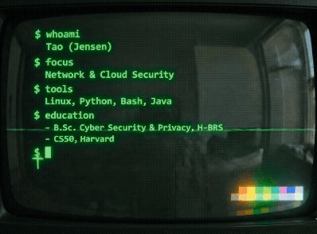

Open-source contributor in cloud security and infrastructure tooling · [tzheng.dev](https://tzheng.dev/)

### Merged upstream

25 pull requests in seven projects, from AWS, Aqua Security, Datadog and Trail of Bits to Prowler and pyinfra.

- **AWS** · [cfn-lint](https://github.com/aws-cloudformation/cfn-lint/pulls?q=is%3Apr+is%3Amerged+author%3A0xTaoZ): 8 PRs on template rules for `Fn::Select`, `Fn::GetAZs` and SAM resources
- **Aqua Security** · [Trivy](https://github.com/aquasecurity/trivy/pull/10939): the Java scanner reads licenses from Jenkins plugin manifests
- **Datadog** · [GuardDog](https://github.com/DataDog/guarddog/pull/797): PyPI Inspector link in remote PyPI findings
- **Trail of Bits** · [Graphtage](https://github.com/trailofbits/graphtage/pull/120): INI file support
- [Prowler](https://github.com/prowler-cloud/prowler/pulls?q=is%3Apr+is%3Amerged+author%3A0xTaoZ): 3 PRs, including a new Kubernetes `hostPath` check
- [pyinfra](https://github.com/pyinfra-dev/pyinfra/pulls?q=is%3Apr+is%3Amerged+author%3A0xTaoZ): 10 PRs, mostly the SSH connector (CA trust from `known_hosts`, sudo with rsync, NFSv4 ACL retry)
- [ansible-lint](https://github.com/ansible/ansible-lint/pull/5110): `var-naming` fix for registered variables

### Projects

- [StudyPulse](https://github.com/0xTaoZ/studypulse-app): study tracker on Cloudflare Workers and D1 that rewards verified results instead of time. FSRS memory model, model-graded recall checks with clamped scoring.
- [cloudtrail-quickscan](https://github.com/0xTaoZ/cloudtrail-quickscan) · [authlog-watch](https://github.com/0xTaoZ/authlog-watch) · [sigma-rule-helper](https://github.com/0xTaoZ/sigma-rule-helper) · [Sentinel-IOC-Toolkit](https://github.com/0xTaoZ/Sentinel-IOC-Toolkit) · [java-web-log-triage](https://github.com/0xTaoZ/java-web-log-triage): small blue-team tools for CloudTrail, SSH logs, Sigma rules, IOCs and access logs
